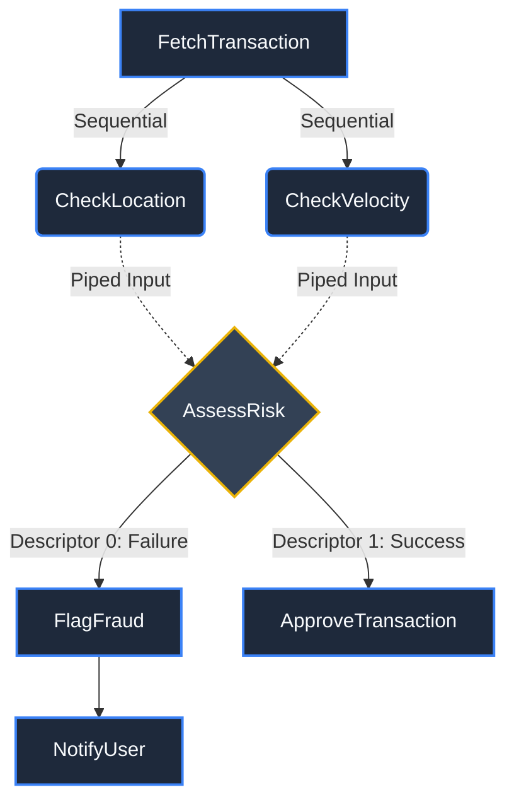

# Graph Generation & Visualization

One of Volnux's most powerful features is its ability to visualize your pipelines. Because orchestration is decoupled from execution via Pointy-Lang, Volnux can parse your `.pty` files into a Directed Acyclic Graph (DAG) and render it visually.

Visualizing your pipelines is crucial for debugging complex routing, parallel execution paths, and conditional branches.

## 1. ASCII Terminal Graphs

For quick debugging during development, you can render a structural tree of your pipeline directly in your terminal. This uses a breadth-first traversal to show parent-child relationships, parallel nodes, and conditional descriptors.

```python
from volnux.pipeline import Pipeline

class FraudDetectionPipeline(Pipeline):
    class Meta:
        pointy = """
        FetchTransaction -> (CheckLocation || CheckVelocity) |-> AssessRisk (
            0 -> FlagFraud -> NotifyUser,
            1 -> ApproveTransaction
        )
        """

# Instantiate the pipeline
pipeline = FraudDetectionPipeline()

# Print the ASCII graph to stdout
pipeline.draw_ascii_graph()
```

**Console Output:**
```text
FraudDetectionPipeline
└── FetchTransaction
    ├── CheckLocation
    │   └── AssessRisk (?)
    │       ├── FlagFraud (No)
    │       │   └── NotifyUser
    │       └── ApproveTransaction (Yes)
    └── CheckVelocity
        └── AssessRisk (?)
            ├── FlagFraud (No)
            │   └── NotifyUser
            └── ApproveTransaction (Yes)
```

Notice how Volnux automatically detects conditional nodes `(?)` and maps their descriptors to `(Yes)` or `(No)` branches!

## 2. Graphviz PNG Generation

If you need a high-quality asset to share with your team or embed in a presentation, Volnux can generate beautiful PNG images of your DAG using the Graphviz rendering engine.

> [!NOTE]
> **Prerequisites**: You must have the `graphviz` python package installed (`pip install graphviz`), and the underlying `dot` binary installed on your system (e.g., `brew install graphviz` on macOS or `apt-get install graphviz` on Linux).

```python
# Generate a PNG image of the pipeline
pipeline.draw_graphviz_image(directory="./pipeline-graphs")
```

This will parse your Pointy-Lang code, construct the mathematical graph, and output a file named `FraudDetectionPipeline.png` in the `./pipeline-graphs` directory.

## 3. Mermaid JS (Markdown Documentation)

If you are documenting your Volnux pipelines in GitHub, GitLab, or a modern documentation site (like the one you are reading right now!), you can manually map your Pointy-Lang flows into **Mermaid JS** graphs. 

This is the industry standard for keeping pipeline architecture diagrams version-controlled alongside your code.

Here is how the `FraudDetectionPipeline` looks when visualized as a Mermaid flowchart:



### Mapping Pointy-Lang to Mermaid

When translating your `.pty` files to Mermaid for your own documentation, use these standard mappings to ensure visual consistency:

- **Sequential (`->`)**: Use a solid arrow `-->`.
- **Piping (`|->`)**: Use a dotted arrow `-.->` to show data flow.
- **Parallel (`||`)**: Split the arrows from the parent node to multiple child nodes at the same level.
- **Conditional Branching (`(0 -> X, 1 -> Y)`)**: Use a Diamond shape `{NodeName}` for the evaluating node, and label the outgoing arrows with the descriptors.

